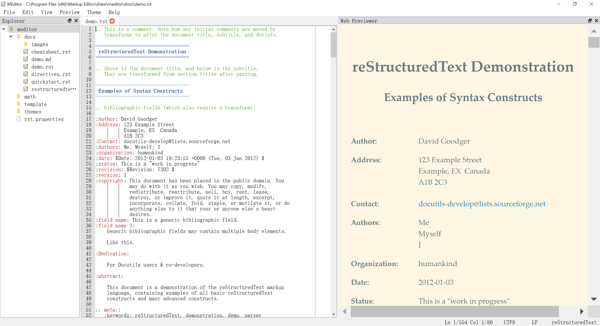
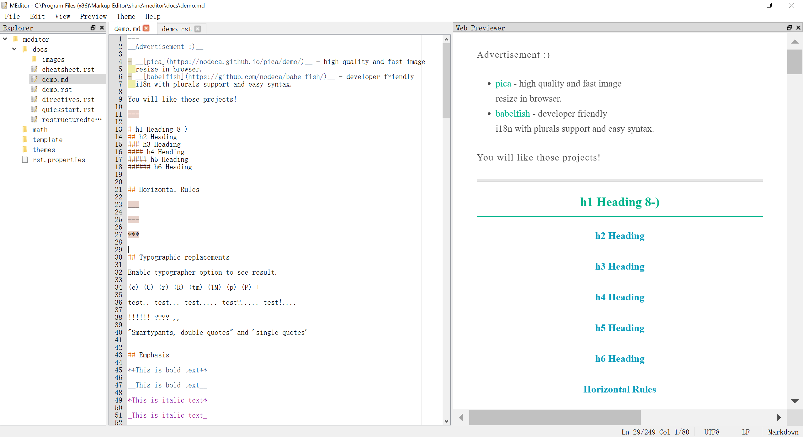

=============
Markup Editor
=============
|version| |download|

Markup Editor is a editor for reStructuredText and Markdown.

.. tip::

   For bad performance, close "preview on input".

Feature
=======
+ support Markdown and reStructuredText
+ Pygments to support Syntax Highlight
+ support MathJax
+ Format table
+ VIM mode
+ HTML Preview
+ Synchronize scroll with preview window
+ drag and drop
+ Multiple workspaces
+ Customized template
+ Peview CSS Themes
+ Multiple editor windows

VIM
===
vim command::

    h, j, k, l          # move left, down, up, right
    ~, gu, gU           # change uppper or lower case
    w, b, e             # move forward or backward by word
    0, ^, $             # move begin of line, first word of line, end of line
    gg, G               # move document top and bottom
    ctrl+f, ctrl+b      # page down and up
    d, db, dw, D, dd    # delete back word, word, to end of line, line
    y, yy, x, X, p      # copy, cut, paste
    i, a, A, o, O       # insert, append, newline
    <, >                # indent
    J, I                # line join, and vertical insert
    u, .                # undo and redo
    /, :/, /<search>, s/<search>/<replace/  # search and replace
    c, w, r             # selection change, read and write
    n [file]            # new window

    ,f                  # format table

vim mode:

+   normal
+   insert
+   visual
+   visual block
+   command: ``:w``, ``:q``

Install
=======
in Linux::

    pip3 install meditor --user

install with download from github::

    # download source
    git clone https://github.com/liuyug/meditor.git
    cd meditor

    # for Virtualenv
    virtualenv ../virtualenv
    # on Linux
    source ../virtualenv/bin/activate
    # on Window cmd
    ../virtualenv/scripts/activate
    # on Window PowerShell
    Set-ExecutionPolicy -Scope CurrentUser  RemoteSigned
    ../virtualenv/scripts/activate

    # check version, above 3.5
    python --version
    pip --version

    # install 3rd packages
    pip install -r requirements.txt
    # prepre data files
    # ui window
    bash ui.sh
    # fetch reStructuredText documents
    bash help.sh
    # for Simple MathJax
    bash math.sh
    # for preview themes
    bash themes.sh
    # for icon theme that is used under win32
    bash icon_theme.sh list
    bash icon_theme.sh <theme name>
    # install meditor
    python3 setup.py install . --user

Screen Shot
===========
check screenshot directory to view more Themes

.. image:: screenshot.png
    :width: 1024

.. |version| image:: 	https://img.shields.io/github/release/liuyug/meditor.svg
   :target: https://pypi.python.org/pypi/meditor
   :alt: Version

.. |download| image:: https://img.shields.io/github/downloads/liuyug/meditor/total.svg
   :target: https://pypi.python.org/pypi/meditor
   :alt: Downloads

Other
======
Iconset: `NuoveXT 2`_ Icons by Saki

.. _`NuoveXT 2`: http://www.iconarchive.com/show/nuoveXT-2-icons-by-saki.2.html
