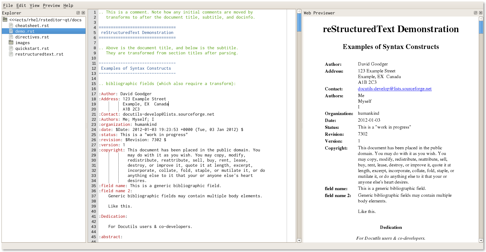

=============
Markup Editor
=============
|version| |download|

Markup Editor is a editor for reStructuredText and Markdown.

.. tip::

   For bad performance, close "preview on input".

Feature
=======
+ support Markdown and reStructedText
+ Syntax Highlight for reStructuredText
+ support MathJax
+ HTML Preview
+ Customized rst properties
+ Synchronize scroll with preview window
+ File system explorer
+ Customized widnow layout
+ reStructuredText Template to reduce extra work
+ Customized HTML css

Install
=======
in Linux::

    pip3 install meditor

or install it in user directory::

    pip3 install meditor --user

HTML theme
===========
get theme::

    bash themes.sh

Screen Shot
===========

.. |version| image:: https://img.shields.io/pypi/v/meditor.png
   :target: https://pypi.python.org/pypi/meditor
   :alt: Version

.. |download| image:: https://img.shields.io/pypi/dm/meditor.png
   :target: https://pypi.python.org/pypi/meditor
   :alt: Downloads

Other
======
Iconset: `NuoveXT 2`_ Icons by Saki

.. _`NuoveXT 2`: http://www.iconarchive.com/show/nuoveXT-2-icons-by-saki.2.html
