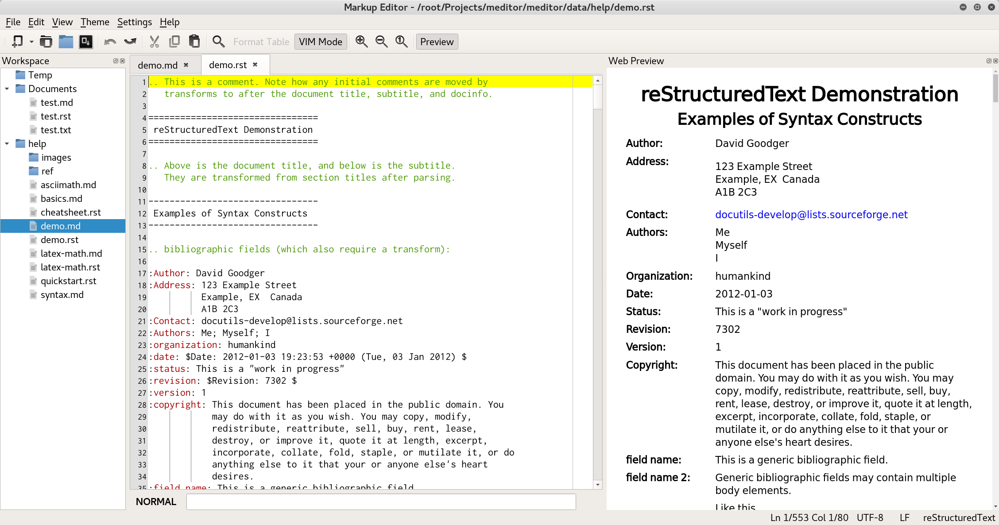

=============
Markup Editor
=============
|version| |download|

Markup Editor is a editor for reStructuredText and Markdown.

.. tip::

   For bad performance, close "preview on input".

Feature
=======
+ support Markdown and reStructuredText
+ Syntax Highlight for reStructuredText
+ support MathJax
+ HTML Preview
+ Customized rst properties
+ Synchronize scroll with preview window
+ File system explorer
+ Customized widnow layout
+ Customized template
+ Customized HTML css
+ Multiple editor windows

Install
=======
in Linux::

    pip3 install meditor --user

install with download from github::

    # download source
    git clone https://github.com/liuyug/meditor.git
    cd meditor

    # for Virtualenv
    virtualenv ../virtualenv
    # on Linux
    source ../virtualenv/bin/activate
    # on Window cmd
    ../virtualenv/scripts/activate
    # on Window PowerShell
    Set-ExecutionPolicy -Scope CurrentUser  RemoteSigned
    ../virtualenv/scripts/activate

    # check version, above 3.5
    python --version
    pip --version

    # install 3rd packages
    pip install -r requirements.txt
    # prepre data files
    # ui window
    bash ui.sh
    # fetch reStructuredText documents
    bash docs.sh
    # for Simple MathJax
    bash math.sh
    # for preview themes
    bash themes.sh
    # for icon theme that is used under win32
    bash icon_theme.sh list
    bash icon_theme.sh <theme name>
    # install meditor
    python3 setup.py install . --user

Screen Shot
===========
check screenshot directory to view more Themes

.. image:: screenshot/screenshot_rst_solarized_light.png
    :width: 1024
.. image:: screenshot/screenshot_md_infoq.png
    :width: 1024

.. |version| image:: 	https://img.shields.io/github/release/liuyug/meditor.svg
   :target: https://pypi.python.org/pypi/meditor
   :alt: Version

.. |download| image:: https://img.shields.io/github/downloads/liuyug/meditor/total.svg
   :target: https://pypi.python.org/pypi/meditor
   :alt: Downloads

Other
======
Iconset: `NuoveXT 2`_ Icons by Saki

.. _`NuoveXT 2`: http://www.iconarchive.com/show/nuoveXT-2-icons-by-saki.2.html
