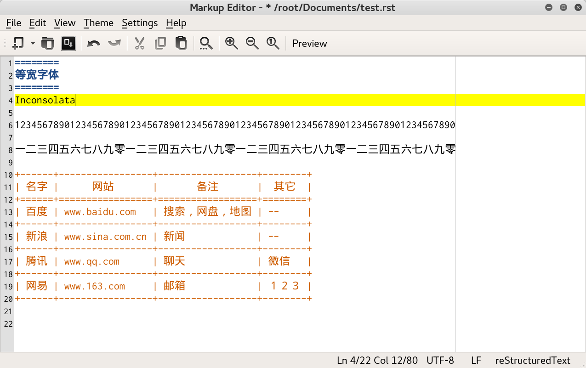

==============
中英文等宽字体
==============
Linux 字体
----------
:Bitstream Vera Sans Mono:  等宽字体，但不予中文字体等宽
:Liberation Mono:           等宽字体，但不予中文字体等宽
:Nimbus Mono L:             等宽字体，但不予中文字体等宽
:DejaVu Sans Mono:          等宽字体，但不予中文字体等宽
:Noto Mono:                 等宽字体，但不予中文字体等宽
:Inconsolata:               等宽字体，中英文等宽

Windows 字体
------------
:Courier:       等宽字体，但不予中文字体等宽
:Consolas:      等宽字体，但不予中文字体等宽
:YaHei:         微软雅黑，中英文完美等宽，但 ``1liIL0oO`` 不能识别
:SimSun:        宋体，情形同上
:Inconsolata:   等宽字体，中英文等宽

等宽英文字体演示
----------------
12345678901234567890123456789012345678901234567890123456789012345678901234567890

一二三四五六七八九零一二三四五六七八九零一二三四五六七八九零一二三四五六七八九零

abcdefghijklmnopqrstuvwxyz

ABCDEFGHIJKLMNOPQRSTUVWXYZ

1liIL0oO

表格测试
--------
+------+-----------------+------------------+--------+
| 名字 |      网站       |       备注       |  其它  |
+======+=================+==================+========+
| 百度 | www.baidu.com   | 搜索，网盘，地图 | --     |
+------+-----------------+------------------+--------+
| 新浪 | www.sina.com.cn | 新闻             | --     |
+------+-----------------+------------------+--------+
| 腾讯 | www.qq.com      | 聊天             | 微信   |
+------+-----------------+------------------+--------+
| 网易 | www.163.com     | 邮箱             | １２３ |
+------+-----------------+------------------+--------+

+------+-----------------+------------------+--------+
| 名字 |      网站       |       备注       |  其它  |
+======+=================+==================+========+
| 百度 | www.baidu.com   | 搜索，网盘，地图 | --     |
+------+-----------------+------------------+--------+
| 新浪 | www.sina.com.cn | 新闻             | --     |
+------+-----------------+------------------+--------+
| 腾讯 | www.qq.com      | 聊天             | 微信   |
+------+-----------------+------------------+--------+
| 网易 | www.163.com     | 邮箱             | １２３ |
+------+-----------------+------------------+--------+

====== ================= ================== ========
 名字        网站               备注          其它
====== ================= ================== ========
 百度   www.baidu.com     搜索，网盘，地图   --
 新浪   www.sina.com.cn   新闻               --
 腾讯   www.qq.com        聊天               微信
 网易   www.163.com       邮箱               １２３
====== ================= ================== ========

+------+-----------------+------------------+--------+
| 百度 | www.baidu.com   | 搜索，网盘，地图 | --     |
+------+-----------------+------------------+--------+
| 新浪 | www.sina.com.cn | 新闻             | --     |
+------+-----------------+------------------+--------+
| 腾讯 | www.qq.com      | 聊天             | 微信   |
+------+-----------------+------------------+--------+
| 网易 | www.163.com     | 邮箱             | １２３ |
+------+-----------------+------------------+--------+

====== ================= ================== ========
 百度   www.baidu.com     搜索，网盘，地图   --
 新浪   www.sina.com.cn   新闻               --
 腾讯   www.qq.com        聊天               微信
 网易   www.163.com       邮箱               １２３
====== ================= ================== ========

